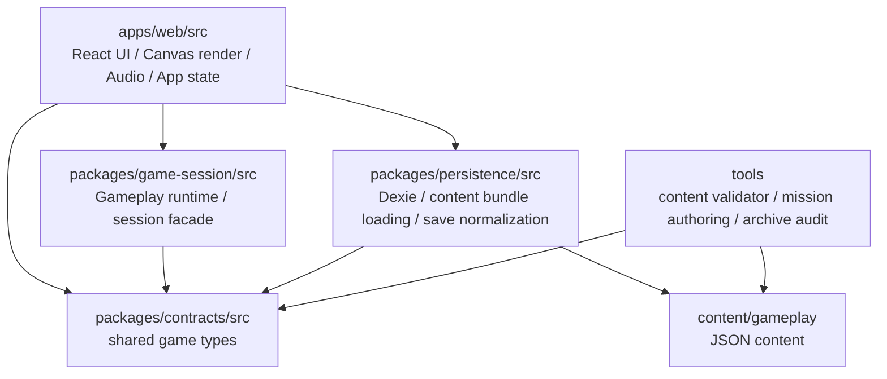

# シューティングゲームプロジェクト 依存関係・リファクタリングチケット

作成日: 2026-05-01  
対象: アップロードZIP `/mnt/data/アーカイブ.zip` を `/mnt/data/project2` に展開したコードベース

このレポートは、コードベース全体の静的依存関係、既存レビュー文書、コンテンツ検証ツール、音声カタログ、ミッションCRUDツール、ソースアーカイブ状態を横断して確認し、エンジニアが着手できる粒度のチケットに落とし込んだものです。

## 1. 調査サマリ

### 1.1 依存関係の概観

リポジトリは以下の4層を中心に構成されています。



主要な実行経路は次の通りです。

`apps/web/src/main.tsx` → `app/App.tsx` → `app/use-magnolia-app.ts` → `app/magnolia-client.ts` → `packages/persistence/load-content-bundle.ts` + `packages/game-session/game-session.ts`

アプリ状態の同期は、`session.dispatch` / `session.stepExplore` / `session.stepBattle` の後に `app/session-sync.ts` がスナップショット、描画状態、プレゼンテーション要求、ドメインイベント、音声イベント、入力エッジ同期をまとめて反映する構造です。

### 1.2 静的解析結果

独自スクリプトで `apps/web/src`、`packages/*/src`、`tools/content-validator/src`、`tools/mission-authoring` を対象に import/export を解析しました。

| 項目 | 結果 |
|---|---:|
| 解析対象ファイル | 184 |
| import/export 辺 | 563 |
| runtime循環依存 | 0 |
| type-only込みの循環依存 | 1 SCC / 6 files |
| `apps/web/src` の未到達ファイル | 0 |
| `apps/web/src` の参照元0ファイル | 1 file |

参照元0ファイルは `apps/web/src/render/battle/fixtures/key-visual-render-state.ts` のみで、既存の key visual 分離後の互換 fixture と見なせるため、現時点では削除候補ではありません。

runtime循環はありません。ただし、`MagnoliaAppState` の型定義が `use-magnolia-app.ts` に置かれているため、以下6ファイルが type-only の循環グループになります。

- `apps/web/src/app/use-magnolia-app.ts`
- `apps/web/src/app/session-sync.ts`
- `apps/web/src/app/magnolia-actions.ts`
- `apps/web/src/app/idle-auto-save.ts`
- `apps/web/src/app/presentation-timers.ts`
- `apps/web/src/app/frame-loop/use-magnolia-frame-loop.ts`

これはビルドを壊す循環ではありませんが、状態合成ルートと補助モジュールの責務境界を曖昧にしています。

### 1.3 検証コマンド結果

| コマンド | 結果 | 備考 |
|---|---|---|
| `node tools/source-audit.mjs` | 初回失敗 | ZIPに `.git` がないため `git ls-files` が使えない。展開コピーで `git init` 後は通過。 |
| `node tools/style-audit.mjs` | 通過 | direct color literals 686件、red threatNoise migration candidates 20件。 |
| `node tools/generate-content-manifest.mjs --check` | 通過 | manifestは更新不要。 |
| `node tools/content-validator/dist/validate-content.js` | 初回失敗 | `docs/05_データ構造.md` が見つからない。ZIP内のdocs名が文字化けしている。展開コピーで正名ファイルを補った後は通過。 |
| `node tools/unicode-filename-audit.mjs` | 通過 | NFCだけを見ているため、文字化けしたファイル名は検出できていない。 |
| `node --test tests/mission-authoring.test.mjs` | 失敗 | Node 18.19.0 では `import.meta.dirname` が `undefined`。 |
| `node --test tests/source-archive.test.mjs` | 失敗 | 同上。 |
| `npm run build` / `tsc -b` | 未完了 | 実行環境でタイムアウト。成功確認はしていない。 |

補足: 今回の環境では Node 18.19.0 が使われており、テスト側はより新しい Node ランタイムを前提にしている可能性があります。プロダクトコードの直接不具合とは切り分けて扱うべきです。

## 2. 発行チケット

### MGN-TOOL-010: ソースアーカイブの衛生状態をCIで保証する

Priority: P0  
担当領域: Tools / Repository hygiene  
種別: 不要ファイル削除、検証自動化

#### 背景

アップロードZIPには、ソースとして不要な生成物・OSメタデータ・キャッシュが含まれています。既存レビュー文書では `MGN-CLN-001` として類似問題が整理されていますが、今回の配布物ではまだ再発しています。

確認された件数:

- `.DS_Store`: 10件
- `*.tsbuildinfo`: 4件
- `dist` 配下ファイル: 209件
- `apps/web/node_modules/.vite`: 20件

また、`tools/source-audit.mjs` と `tools/create-source-archive.mjs` は `git ls-files` に依存しており、ZIP展開状態では `.git` がないため監査できません。

#### 影響

配布物レビュー時に、実ソースと生成物の境界が不明になります。依存関係解析や未使用ファイル検出でも false positive が増えます。さらに、ソースアーカイブそのものを検証するツールがGit作業ツリー前提になっているため、受領側で再検証できません。

#### 作業内容

1. ルート `.gitignore` を再確認し、少なくとも以下を含める。
   - `.DS_Store`
   - `node_modules/`
   - `.vite/`
   - `dist/`
   - `*.tsbuildinfo`
   - `__MACOSX/`
2. `npm run archive:source` 以外の手動ZIP配布を禁止する運用に寄せる。
3. `tools/source-audit.mjs` に、Git作業ツリーではない場合の明確なエラーまたはfilesystem fallbackを追加する。
4. ソースアーカイブ検査に「生成物が0件であること」を含める。
5. CIで source archive 作成後のZIPを展開し、同じ検査を走らせる。

#### 受け入れ条件

- 次回配布ZIP内で `.DS_Store`、`*.tsbuildinfo`、`dist/`、`.vite/`、`node_modules/` が0件。
- `npm run source:audit` がGit作業ツリーでは通過する。
- ZIP展開状態でも、ツールが「検査不能」ではなく「検査可能」または「Git必須の明確な理由付きエラー」を返す。
- 既存の `docs/latest_Review/10_cleanup_tickets_2026-04-30.md` と重複しないよう、完了条件を現在の配布物ベースに更新する。

---

### MGN-TOOL-011: 文字化けしたdocsファイル名を復旧し、Unicode監査を強化する

Priority: P0  
担当領域: Tools / Docs / Content validation  
種別: 参照不明、検証漏れ

#### 背景

ZIP内のdocsファイル名が文字化けしています。例:

- 期待: `docs/05_データ構造.md`
- 実際: `docs/05_πâåπéÖπâ╝πé┐µºïΘÇá.md`

ファイル本文の見出しは正しい日本語ですが、ファイル名だけが壊れています。このため、content validator は `docs/05_データ構造.md` を見つけられず失敗しました。一方で `tools/unicode-filename-audit.mjs` はNFC正規化だけを検査しているため、この文字化けを検出できていません。

#### 影響

docsを参照するコンテンツ監査が、配布物で失敗します。さらに、Unicode監査が通っても実際には期待ファイル名が存在しないため、監査結果への信頼性が下がります。

#### 作業内容

1. 文字化けしたdocsファイル名を正しい日本語ファイル名へ戻す。
2. `unicode-filename-audit` に「期待されるdocsファイル名が存在すること」の検査を追加する。
3. `tools/content-validator/src/reference-rules.ts` の docs audit と同じ期待ファイル名リストを、監査側と二重管理しない形に寄せる。
4. ZIP作成時にファイル名エンコーディングが破損しないことを `source-archive.test.mjs` で検証する。

#### 受け入れ条件

- 展開直後の配布ZIPで `docs/05_データ構造.md` が存在する。
- 展開直後に `node tools/content-validator/dist/validate-content.js` が通過する。
- `unicode-filename-audit` がNFCだけでなく、期待docs名の欠落または文字化け名を検出できる。
- `tests/source-archive.test.mjs` が正しいdocs名を検証する。

---

### MGN-APP-010: `MagnoliaAppState` をcomposition rootから分離して type-only 循環を解消する

Priority: P1  
担当領域: Web app architecture  
種別: 依存関係整理、責務明確化

#### 背景

runtime循環はありませんが、`MagnoliaAppState` が `apps/web/src/app/use-magnolia-app.ts` に定義されているため、周辺モジュールがcomposition rootであるhookへ型参照しています。

対象ファイル:

- `app/session-sync.ts`
- `app/magnolia-actions.ts`
- `app/idle-auto-save.ts`
- `app/presentation-timers.ts`
- `app/frame-loop/use-magnolia-frame-loop.ts`

#### 影響

hookがアプリ状態の実装詳細だけでなく、状態型の定義元にもなっているため、補助モジュールの責務が逆向きに見えます。今後の分割時に「どちらが上位レイヤーか」が判断しづらくなります。

#### 作業内容

1. `apps/web/src/app/app-state.ts` または `apps/web/src/app/app-types.ts` を追加する。
2. `MagnoliaAppState` と必要に応じて状態setter型をそこへ移動する。
3. 周辺モジュールは `use-magnolia-app.ts` ではなく新しい型定義モジュールからimportする。
4. `use-magnolia-app.ts` は状態の合成とhook公開に集中させる。

#### 受け入れ条件

- 静的import解析で type-only SCC が0になる。
- runtime依存が増えない。
- `use-magnolia-app.ts` をimportするのは `App.tsx` などcomposition root側に限定される。
- 既存UI挙動、autosave、frame loop、session syncに変化がない。

---

### MGN-APP-011: `session.dispatch` 後の同期処理を共通コマンドランナーに集約する

Priority: P1  
担当領域: Web app data flow  
種別: 迂回・断片化したデータフロー

#### 背景

`magnolia-actions.ts` と `frame-loop/use-magnolia-frame-loop.ts` の両方に、以下のパターンが点在しています。

```ts
await session.dispatch(command);
syncFromSession(session);
```

また、frame loop側では `openMap` 時に `tryOpenMap(session)` を呼び、ロック時popupを出してからdispatch可否を決めています。これは入力・UI副作用・session command・syncが複数モジュールに散っている状態です。

具体例:

- `magnolia-actions.ts` の `runCommand`
- `magnolia-actions.ts` 内の複数action handler
- `frame-loop/use-magnolia-frame-loop.ts` の `closePanel` / `openMap` / `openEquipment`
- explore/battle step後の `syncFromSession`

#### 影響

新しいコマンドを追加すると、dispatch後にsyncを忘れるリスクがあります。UI副作用を伴う command guard が actions と frame loop にまたがるため、仕様変更時の追跡も難しくなっています。

#### 作業内容

1. `apps/web/src/app/session-command-runner.ts` を追加する。
2. `dispatchAndSync(session, command, options)` のような共通関数を定義する。
3. `openMap` のように事前guardとpopupが必要なものは、`command guards` として集約する。
4. `magnolia-actions.ts` と `frame-loop/use-magnolia-frame-loop.ts` から直接の `session.dispatch(...).then(sync...)` を削減する。
5. step系は commandとは性質が違うため、`stepAndSync` として分けるか、現状維持するかを設計判断する。

#### 受け入れ条件

- `frame-loop/use-magnolia-frame-loop.ts` に直接の `session.dispatch({ type: ... }).then(...)` が残らない。
- `magnolia-actions.ts` のdispatch後syncが共通ランナー経由になる。
- map locked時のpopup、open map、open equipment、close panelの既存挙動がテストで保持される。
- `session-sync.ts` の責務は「同期」に限定され、dispatch判断を持たない。

---

### MGN-APP-012: save slotの空判定とautosave選択をselector化する

Priority: P1  
担当領域: Web app persistence UI  
種別: 重複機能、責務整理

#### 背景

save slotの空判定が2か所に重複しています。

- `apps/web/src/app/use-magnolia-app.ts`: `isTitleSaveSlotEmpty`
- `apps/web/src/app/idle-auto-save.ts`: `isTitleSaveSlotEmpty`

どちらも `!slot.profileId || slot.playTimeMs <= 0` という同じ意味の判定です。さらに、`idle-auto-save.ts` には `selectIdleAutoSaveSlot` と `readSlotUpdatedAtMs` があり、slot選択ロジックがUI summary構築とautosaveロジックの間で分散しています。

#### 影響

save slot仕様が変わったときに、title表示とautosave選択で判定がずれる可能性があります。`use-magnolia-app.ts` には既に分割済み実装を説明する長い `MGN-REF-003` コメントも残っており、実装とコメントの距離が広がっています。

#### 作業内容

1. `apps/web/src/app/save-slot-selectors.ts` を追加する。
2. 以下を移動・共通化する。
   - `isTitleSaveSlotEmpty`
   - `readSlotUpdatedAtMs`
   - `selectIdleAutoSaveSlot`
3. `buildSaveSlotSummaries` と `useIdleAutoSave` が同じselectorを使うようにする。
4. `use-magnolia-app.ts` の `MGN-REF-003` 長文コメントは、短い不変条件コメントに置き換えるか、最新review ticketへ移す。

#### 受け入れ条件

- save slotの空判定が1実装に集約されている。
- autosave対象選択とtitle save summaryの表示が同じ判定を使う。
- 既存の空slot優先・最古slot上書き挙動がテストで維持される。
- `use-magnolia-app.ts` から分割済み実装の詳細コメントが消える。

---

### MGN-RENDER-010: render math / coordinate helperの重複を削減する

Priority: P1  
担当領域: Rendering / Gameplay runtime  
種別: 重複機能

#### 背景

同じ意味に見える小さなhelperが複数箇所に存在します。

`clamp01` の重複候補:

- `apps/web/src/render/shared/render-math.ts`
- `apps/web/src/app/ship-renderer.ts`
- `apps/web/src/render/battle/enemies/enemy-renderer.ts`
- `apps/web/src/screens/battle/BattleScreen.tsx`
- `apps/web/src/screens/explore/ExploreScreen.tsx`
- `packages/game-session/src/explore-world.ts`
- `packages/game-session/src/battle-world.ts`
- `packages/game-session/src/battle/movement-system.ts`

`toCanvasPoint` / 座標変換の重複候補:

- `apps/web/src/render/shared/coordinates.ts`: `worldToCanvasPoint`
- `apps/web/src/render/explore/restricted-boundary.ts`
- `apps/web/src/render/explore/explore-scene-renderer.ts`
- `apps/web/src/render/explore/trail.ts`
- `apps/web/src/render/map/map-renderer.ts`

`seededUnit` / hash系の重複候補:

- `apps/web/src/render/shared/render-math.ts`
- `apps/web/src/render/map/map-renderer.ts`
- `apps/web/src/screens/battle/BattleScreen.tsx`
- `apps/web/src/render/battle/battle-renderer-utils.ts`
- `packages/game-session/src/game-session.ts`
- `packages/game-session/src/battle-world.ts`

#### 影響

描画座標や擬似乱数の仕様が微妙にずれると、画面・map・battle fixture・key visual間で再現性が崩れます。`clamp01` のような汎用関数は小さいため放置されがちですが、重複箇所が増えると修正漏れの原因になります。

#### 作業内容

1. Web描画層では既存の `render/shared/render-math.ts` と `render/shared/coordinates.ts` を正本にする。
2. `toCanvasPoint` 系は `worldToCanvasPoint` に寄せる。
3. `seededUnit` / `hashString` は、描画専用とgame-session runtime専用で意味が同じか確認してから統合する。
4. `packages/game-session` 側の `clamp01` は、`battle-world.ts` 由来の命名が不適切なら package-local `math.ts` へ移す。
5. audioやsave normalizerなど、同名でも責務が違うhelperは無理に統合しない。

#### 受け入れ条件

- Web描画層の `clamp01` / `toCanvasPoint` / `seededUnit` 重複が削減される。
- map、explore、battle、key visual fixtureの描画差分が意図した範囲に収まる。
- game-session側の統合は、同じ意味の関数だけに限定される。
- `agent.md` のDRY方針どおり、単なる形の一致だけで抽出しない。

---

### MGN-AUDIO-010: `soundCatalog` と `public/sound` の不整合を解消する

Priority: P0  
担当領域: Audio  
種別: 参照先不明、未使用実装、実ファイル不整合

#### 背景

`apps/web/src/audio/soundCatalog.ts` が参照している音声URLと、`apps/web/public/sound` の実ファイルに大きな差分があります。

特に重要な不整合:

- catalogは `/sound/placeholder/shot-placeholder.wav` を参照している。
- 実ファイルは `/sound/placeholder/shot-placeholder.mp3`。
- catalogは `/sound/barrier/barrier-up.wav` 系ではなく、多数の `.wav` を参照している。
- 実ファイルには `/sound/barrier/barrier-up.mp3` があるが、catalogからは参照されていない。

確認結果:

- catalog参照URL: 43件
- 実音声ファイル: 22件
- catalogから参照されているが実ファイルがないURL: 23件
- 実ファイルがあるがcatalogから参照されていないURL: 2件

missing候補:

- `/sound/barrier/barrier-break.wav`
- `/sound/barrier/barrier-down.wav`
- `/sound/barrier/barrier-hit.wav`
- `/sound/barrier/barrier-loop.wav`
- `/sound/bgm/bgm-battle.wav`
- `/sound/bgm/bgm-explore.wav`
- `/sound/bgm/bgm-mission.wav`
- `/sound/combat/enemy-destroyed.wav`
- `/sound/combat/enemy-hit.wav`
- `/sound/combat/enemy-shot.wav`
- `/sound/combat/no-ammo.wav`
- `/sound/combat/player-shot.wav`
- `/sound/equipment/equipment-use.wav`
- `/sound/explore/equipment-pickup.wav`
- `/sound/explore/explore-scan-hit.wav`
- `/sound/explore/item-pickup.wav`
- `/sound/mission/mission-clear.wav`
- `/sound/mission/mission-fail.wav`
- `/sound/mission/mission-in.wav`
- `/sound/mission/mission-objective-update.wav`
- `/sound/noise/radio-static-loop.wav`
- `/sound/placeholder/shot-placeholder.wav`
- `/sound/voice/radio-blip.wav`

orphan候補:

- `/sound/barrier/barrier-up.mp3`
- `/sound/placeholder/shot-placeholder.mp3`

#### 影響

`AudioHub` はoptional assetのmissingを許容していますが、placeholder shotはunlock時に使われる可能性があるため、URL不一致のままだと初回unlock・preload・警告ログの挙動が不安定になります。音が鳴らないことが仕様なのか、素材待ちなのか、参照ミスなのかが判断できません。

#### 作業内容

1. canonicalな拡張子を決める。既存ファイルに合わせるなら catalogを `.mp3` へ修正する。
2. `SOUND_ASSETS` の各assetに `required` / `optional` / `placeholder` / `planned` のような状態を明示する。
3. `public/sound` と `SOUND_ASSETS` を突き合わせる監査スクリプトを追加する。
4. required missingはCI失敗、optional missingは警告またはinventory出力にする。
5. orphanファイルはcatalogに登録するか削除する。
6. `docs/sound-inventory.md` を実状態に合わせて更新する。

#### 受け入れ条件

- `/sound/placeholder/shot-placeholder.*` のcatalog参照と実ファイルが一致する。
- required扱いのsoundでmissingが0件。
- orphan音声ファイルが0件、または明示的にinventoryへ分類されている。
- audio auditがCIで実行される。

---

### MGN-CRUD-010: mission authoring CLIのupdate/deleteをindex指定からstable ID指定へ移行する

Priority: P1  
担当領域: Mission authoring / Content tooling  
種別: CRUD不明確、参照元・参照先整理

#### 背景

ミッションコンテンツには `waveId` と `spawnId` が導入され、content validatorでも存在が要求されています。一方で、mission authoring CLIのupdate/deleteはまだindex指定を多用しています。

例:

- wave update/delete: `--index`
- enemy-spawn add/update/delete: `--wave-index`, `--entry-index`

既存テストもindex指定を前提にしています。

#### 影響

配列順を並べ替えると、update/delete対象が変わるリスクがあります。コンテンツがID参照へ移行しているのに、CRUD操作だけがindexに依存しているため、編集ツールとしての信頼性が下がります。

#### 作業内容

1. wave操作を `--wave-id` ベースへ移行する。
2. enemy spawn操作を `--wave-id` + `--spawn-id` ベースへ移行する。
3. `--index` / `--wave-index` / `--entry-index` は一時的にdeprecatedとして残すか、明確なエラーを出して移行を促す。
4. `tools/mission-authoring/README.md` をID指定ベースに更新する。
5. `tests/mission-authoring.test.mjs` をID指定ベースに更新する。
6. `waveId` / `spawnId` の重複検出とrename操作の影響範囲を明文化する。

#### 受け入れ条件

- waveのupdate/deleteが `waveId` で実行できる。
- enemy spawnのupdate/deleteが `waveId` + `spawnId` で実行できる。
- wave配列やspawn配列を並べ替えても、同じIDの対象が更新・削除される。
- deprecated index指定を使った場合の挙動がREADMEとCLIメッセージで一致する。

---

### MGN-DOC-010: 実装済み分割コメントとFuture placeholderを整理する

Priority: P2  
担当領域: Docs / Code comments  
種別: 使っていないコメント、意図不明コメント

#### 背景

以下のコメントは、実装の現状よりも古い作業メモまたは将来メモに近く、コード中に残す意義が薄くなっています。

- `apps/web/src/app/use-magnolia-app.ts` の `MGN-REF-003` 長文コメント
- `apps/web/src/render/explore/nav-cue.ts` の `[Future B] 共鳴パルス挿入ポイント`
- `apps/web/src/screens/explore/ExploreScreen.tsx` のBGM同期前仮プロファイルコメント

一方で、audio virtual clockなどの不変条件コメントは有用なので削除対象ではありません。

#### 影響

「実装上の制約」なのか「完了済み作業のメモ」なのか「未来アイデア」なのかが混ざると、エンジニアが変更時に守るべき条件を判断しづらくなります。

#### 作業内容

1. 完了済み作業の説明コメントは削除するか、短い不変条件に置き換える。
2. 将来アイデアは `docs/latest_Review` またはissue化し、コードからは外す。
3. 仮実装コメントは、期限・解除条件・担当領域を明示する。
4. `TODO/FIXME/Future/MGN-` コメントの棚卸しをCIまたは定期レビューで行う。

#### 受け入れ条件

- コード内に「完了済みチケットの長文説明」が残らない。
- Futureコメントはissueまたはreview docに移されている。
- 残るコメントは、実装上守るべき不変条件または現在の制約に限定される。

---

### MGN-TOOL-012: Nodeランタイム要件を明示し、テスト互換性を戻す

Priority: P1  
担当領域: Tooling / Tests  
種別: 検証不能状態の解消

#### 背景

`tests/mission-authoring.test.mjs` と `tests/source-archive.test.mjs` は `import.meta.dirname` を使っています。今回の環境 Node 18.19.0 では `import.meta.dirname` が `undefined` になり、テストが失敗しました。

#### 影響

プロダクトコードの問題ではなく、テスト実行環境とコードの前提バージョンの不一致です。ただし、CIや受領側環境でNode 18が使われると、検証が止まります。

#### 作業内容

選択肢A: Node 20.11+ などを正式要件にする。

- `package.json` に `engines.node` を追加。
- READMEまたは開発手順にNode要件を明記。
- CIのNode versionを固定。

選択肢B: Node 18互換へ戻す。

- `import.meta.dirname` を `fileURLToPath(import.meta.url)` + `dirname` へ置換。
- テストでNode 18互換を維持する。

#### 受け入れ条件

- 宣言されたNode versionで `node --test tests/mission-authoring.test.mjs` が通過する。
- 宣言されたNode versionで `node --test tests/source-archive.test.mjs` が通過する。
- サポート外Nodeでは、失敗理由が明確に表示される。

---

### MGN-SESSION-010: `MagnoliaGameSession` の残り責務を段階的に切り出す

Priority: P2  
担当領域: Game session runtime  
種別: 肥大化、責務整理

#### 背景

既存レビューでは `MGN-REF-001` として `game-session.ts` の一部切り出しが進んでいます。それでも、現時点で `packages/game-session/src/game-session.ts` は約2300行あり、public facade、dispatch、explore/battle step、profile/save/archive、equipment economy、fragment restoration、hazard、view model構築などが同居しています。

#### 影響

public APIの中心であること自体は自然ですが、private helper群まで同居しているため、変更時に影響範囲を見積もりづらくなっています。session facadeの責務と、各ドメインサービスの責務を分ける余地があります。

#### 作業内容

一括分割ではなく、以下のように意味のある単位で段階的に切り出します。

1. save slot / profile command handler
2. archive selection / archive read model builder
3. equipment economy / inventory mutation helper
4. battle fragment restoration / hazard interaction helper
5. world map visibility / interaction helper

public APIは `MagnoliaGameSession` に残し、外部呼び出し側の変更を最小化します。

#### 受け入れ条件

- `game-session.ts` の行数が段階的に減る。
- `MagnoliaGameSession` のpublic method数と外部APIは原則維持される。
- 切り出したモジュールに双方向依存が発生しない。
- session snapshot、save/load、explore step、battle stepの回帰テストが通過する。

---

### MGN-STYLE-010: direct color literalの残件をデザイントークンへ移行する

Priority: P2  
担当領域: Styling  
種別: 重複・スタイル正本化

#### 背景

`tools/style-audit.mjs` は通過していますが、direct color literalはまだ686件あります。既存レビューで `MGN-REF-005` として削減が進んでいるため、このチケットは継続改善枠です。

特に残件が多い・red threatNoise候補がある領域:

- `apps/web/src/styles/menu-equipment.css`
- `apps/web/src/styles/battle.css`
- `apps/web/src/styles/common-ui.css`
- `apps/web/src/styles/title.css`
- `apps/web/src/styles/archive-settings.css`

#### 影響

色の意味が各CSSに散っているため、テーマ変更やアクセシビリティ調整時に修正漏れが起きやすくなります。

#### 作業内容

1. 既存のpalette/tokenを確認する。
2. threatNoise red系の残件を先にtoken化する。
3. UI共通色、battle演出色、equipment menu色を用途別に分類する。
4. 目標件数を段階的に設定する。例: 686 → 600 → 500。

#### 受け入れ条件

- style auditが通過する。
- red threatNoise migration candidatesが減る。
- 新規direct color literalの追加がレビューで検知される。

## 3. 削除・統合候補一覧

### 3.1 すぐ削除できる可能性が高いもの

- ZIP内の `.DS_Store`
- ZIP内の `*.tsbuildinfo`
- ZIP内の `dist/`
- ZIP内の `.vite/`
- catalogから参照されていない音声ファイル。ただし、素材として保持するならinventoryへ明示分類する。

### 3.2 すぐ削除せず、正本化してから統合するもの

- `clamp01` 系helper
- `toCanvasPoint` 系helper
- `seededUnit` / `hashString` 系helper
- save slot空判定
- dispatch後syncパターン

### 3.3 削除ではなく責務移動すべきもの

- `MagnoliaAppState` 型定義
- `use-magnolia-app.ts` の長文分割コメント
- `mission-authoring` のindex指定CRUD
- `game-session.ts` 内のprivate helper群

## 4. 優先順位つき実施順

最初に着手すべきなのは、配布物と検証の信頼性を直すP0です。`MGN-TOOL-010`、`MGN-TOOL-011`、`MGN-AUDIO-010` を先に片付けると、以降のレビューが安定します。

次に、アプリ側のデータフローを整理します。`MGN-APP-010` で型循環を切り、`MGN-APP-011` でdispatch後syncを正本化し、`MGN-APP-012` でsave slotの重複判定を消します。この3件は互いに近い領域なので、同じ担当者または連続PRにするとレビューしやすいです。

その後、`MGN-CRUD-010` と `MGN-RENDER-010` を進めます。CRUDはコンテンツ編集の安全性に直結し、render helper統合は見た目の差分確認が必要です。

最後に、`MGN-SESSION-010` と `MGN-STYLE-010` を継続改善として進めます。どちらも一括でやるとリスクが高いため、意味単位ごとの小さなPRに分けるべきです。

## 5. 補足: 解析成果物

静的import graphのJSONは `/mnt/data/project2_analysis_import_graph.json` に保存されています。チケット実装後に同じ解析を再実行し、runtime循環・type-only循環・未到達ファイル・重複helper数が減っていることを確認すると効果測定できます。

今回確認できたこと:

- web runtime dependencyに循環はない。
- web sourceの未到達ファイルはない。
- ただし、AppState型の置き場所によりtype-only循環がある。
- ツール・配布物・音声catalog・mission CRUDに、実作業へ落とせる不整合が残っている。

今回確認できなかったこと:

- `npm run build` の成功。
- TypeScript project build全体の成功。
- Node 20以上でのtest結果。
- ブラウザ上での音声unlock・描画差分の実機確認。
